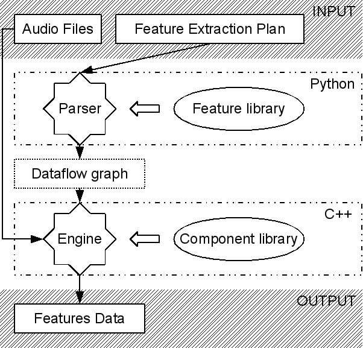

Yaafe internals
===============

Overview
--------

.. _overview:

   
   
*Yaafe* feature extraction operates in two main steps, that are done together by the ``yaafe.py`` script, but can be done separately according to your needs.

Feature Plan Parser
"""""""""""""""""""

Each feature is defined as a sequence of computational steps. For example, MFCC is the succession of steps: Frames, FFT,MelFilterBank, Cepstrum. The
same applies to feature transforms and temporal integrators.

The *Feature Plan Parser* is responsible for creating the *dataflow graph* according to a given *feature extraction plan* and a working samplerate.
It decomposes each declared feature into steps and groups together identical steps which have the same input into a reduced
directed graph of computational steps. 

Dataflow Engine
"""""""""""""""

Each computational step is implemented in a C++ component which performs computation on a data block. Specific
components manage audio file reading and output file writing. The dataflow engine loads components, links them according
to the given dataflow graph, schedule computations and manage data blocks. Reading, computations and writing
is done block by block, so that arbitrarily long files or signals can be processed with a low memory occupation.

The ``yaafe-engine`` program consist in loading the dataflow engine configured with a *dataflow file*, and processing given audio files.

.. _featplan:

Feature extraction plan
-----------------------

A feature extraction plan (or feature plan) is a text file defining a list of features to extract.
Each lines defines a feature according to the feature definition syntax.

Feature definition syntax
"""""""""""""""""""""""""

.. productionlist:: featdef
	feature_definition: `name` := `feature` parameters [transformations]
	transformations: > `transform` parameters [transformations]
	parameters: `key` ="`value`" [parameters] |
	          : `key` = `value` [parameters]

With the following tokens:

:token:`name`
	Name of declared feature. This name will be used for the output dataset, or the output stream.
	
:token:`feature`
	Feature name. Use ``yaafe.py -l`` to list available features.
	
:token:`key`
	Parameter key

:token:`value`
	Parameter value. If not delimited by double-quotes ("), it must contains only [a-zA-Z0-9.:_/-],
	otherwise it may contains any characters.

Example
"""""""

The following feature plan defines the extraction of 5 features: mfcc, mfcc_d1, mfcc_d2, sf, sr::

	mfcc: MFCC blockSize=512 steSize=256
	mfcc_d1: MFCC blockSize=512 steSize=256 > Derivate DOrder=1
	mfcc_d2: MFCC blockSize=512 steSize=256 > Derivate DOrder=2
	sf: SpectralFlatness blockSize=1024 steSize=256
	sr: SpectralRolloff blockSize=1024 steSize=256

.. _dataflow-file:

Dataflow file
-------------

A dataflow file is a file defining a dataflow graph (see the :ref:`overview figure<overview>`). The dataflow graph
is a directed acyclic graph where nodes define computational steps to compute the desired outputs.

There mainly 2 ways of building the *dataflow graph* corresponding to a :ref:`feature extraction plan <featplan>`
The *dataflow graph* can be dumped into a file using the ``--dump-dataflow`` option of ``yaafe.py`` (see :ref:`here <get-dataflow-file>`).
It also can be created using the Python :py:class:`FeaturePlan` 

The :ref:`dataflow file syntax <dataflow-syntax>` is described in the following section.
The dataflow file can be reused directly by :doc:`other Yaafe tools<tools>`.

.. _dataflow-syntax:

Dataflow file syntax
""""""""""""""""""""

The dataflow file syntax is defined with the following grammar:

.. productionlist::
   dataflow_file: flow_stmt+
   flow_stmt: (lib_stmt | input_stmt | output_stmt | node_stmt | link_stmt) NEWLINE
   lib_stmt: 'useComponentLibrary' `libname`
   input_stmt: `node` ':=' 'Input' [parameters]
   output_stmt: `node` ':=' 'Output' [parameters]
   node_stmt: `node` ':=' `component` [parameters]
   parameters: `key` '="' `value` '"' [parameters]
   link_stmt: `node`[':' `port`] '>' `node`[':' `port`]

:token:`libname`
	Component library name. This library contains some of the components used in the dataflow

:token:`node`
	Node identifier. In the context of a *input_stmt* (or *output_stmt*), :token:`node` is
	the input name (or output name).
	
:token:`component`
	A valid component name.

:token:`key`
	Parameter key

:token:`value`
	Parameter value

:token:`port`
	name of the node's port to link. If no port defined, assume the node has only
	one input (or output) port.

Example
"""""""

Here is the dataflow generated for extracting MFCC over a 44.1kHz audio file::

	> yaafe.py -r 44100 -f "mfcc: MFCC" --dump-dataflow=yaflow
	> more yaflow
	useComponentLibrary yaafe-components
	audio := Input SampleRate="44100"
	n1 := FrameTokenizer blockSize="1024" stepSize="512"
	n2 := FFT FFTLength="1024" FFTWindow="Hanning"
	n3 := Abs
	n4 := MelFilterBank MelMaxFreq="6854.0" MelMinFreq="130.0" MelNbFilters="40"
	n5 := Cepstrum CepsIgnoreFirstCoeff="1" CepsNbCoeffs="13"
	mfcc := Output normalize="-1" version="v0.6" yaafedefinition="MFCC"
	audio > n1
	n1 > n2
	n2 > n3
	n3 > n4
	n4 > n5
	n5 > mfcc

Here is another example for extracting several features::

	> cat > featureplan
	mfcc: MFCC
	mfcc_d1: MFCC > Derivate DOrder=1
	mfcc_d2: MFCC > Derivate DOrder=2
	sf: SpectralFlatness
	sr: SpectralRolloff
	
	> yaafe.py -c featureplan -r 44100 --dump-dataflow=yaflow
	> more yaflow
	useComponentLibrary yaafe-components
	audio := Input SampleRate="44100"
	n1 := FrameTokenizer blockSize="1024" stepSize="512"
	n2 := FFT FFTLength="1024" FFTWindow="Hanning"
	n3 := Abs
	n4 := MelFilterBank MelMaxFreq="6854.0" MelMinFreq="130.0" MelNbFilters="40"
	n5 := Cepstrum CepsIgnoreFirstCoeff="1" CepsNbCoeffs="13"
	mfcc := Output normalize="-1" version="v0.6" yaafedefinition="MFCC"
	n7 := Derivate DO1Len="4" DO2Len="1" DOrder="1"
	mfcc_d1 := Output normalize="-1" version="v0.6" yaafedefinition="MFCC > Derivate DOrder=1"
	n9 := Derivate DO1Len="4" DO2Len="1" DOrder="2"
	mfcc_d2 := Output normalize="-1" version="v0.6" yaafedefinition="MFCC > Derivate DOrder=2"
	n11 := Flatness
	sf := Output normalize="-1" version="v0.6" yaafedefinition="SpectralFlatness"
	n13 := Sqr
	n14 := Rolloff
	sr := Output normalize="-1" version="v0.6" yaafedefinition="SpectralRolloff"
	audio > n1
	n1 > n2
	n2 > n3
	n3 > n4
	n4 > n5
	n5 > mfcc
	n5 > n7
	n7 > mfcc_d1
	n5 > n9
	n9 > mfcc_d2
	n3 > n11
	n11 > sf
	n3 > n13
	n13 > n14
	n14 > sr

.. _get-dataflow-file:

Get the *dataflow file* from the *feature plan*
"""""""""""""""""""""""""""""""""""""""""""""""

First, write your :ref:`feature plan <featplan>` to define features to extract. For example, consider
the following one::

	mfcc: MFCC
	mfcc_d1: MFCC > Derivate DOrder=1
	mfcc_d2: MFCC > Derivate DOrder=2
	sf: SpectralFlatness
	sr: SpectralRolloff
	
Then, get the corresponding Yaafe dataflow file using the ``yaafe.py`` script::

	> yaafe.py -r 44100 -c featureplan --dump-dataflow=yaflow
	
This command produces a file named 'yaflow', which is the dataflow file
corresponding to the given feature extraction plan:: 

	> cat yaflow
	useComponentLibrary yaafe-components
	audio := Input SampleRate="44100"
	n1 := FrameTokenizer blockSize="1024" stepSize="512"
	n2 := FFT FFTLength="1024" FFTWindow="Hanning"
	n3 := Abs
	...
	
Pay attention to the fact that a Yaafe dataflow file is **designed for a specific analysis
sample rate**. To extract same features on signals or files with other sample rate, you have
to create another dataflow file.

.. _processingengine:

Yaafe's dataflow processing engine
----------------------------------

Yaafe has its own dataflow processing engine, implemented in the ``Engine`` C++ class. Yaafe is able to process audio streams
block per block, so that it can process arbitrarily long streams. The programmer who wants to use Yaafe to compute features
providing audio block per block (directly from C++ or from Python bindings) should have an idea how Yaafe's engine works.

Objectives
""""""""""

Yaafe's dataflow processing engine process data block per block in order to be able to analyze long audio streams efficiently.
But Yaafe's is not ''realtime'', and provide no guarantee on when the feature values are available.

Overview
""""""""

The dataflow file to process represents a directed acyclic graph where nodes are computation step (FFT, cepstrum, sum, ...) and
links are communication streams. A stream is a FIFO queue, implemented in the ``Buffer.h`` and ``Buffer.cpp`` C++ files.

It has been decided to implement a stream with data blocks of fixed size, and only full data block are transmitted. Consequently,
on every communication streams in the graph, the engine waits to have enough data before transmitting data to the next computation step.
With a suitable data block size, this strategy has proven to be very cache efficient, for both data and code.

Feature values availability
"""""""""""""""""""""""""""

Processing data block per block has an impact on when feature result values will be available. So the programmer should have the following points in mind:

* Yaafe's engine waits to have enough data before processing any computation
* When providing an audio chunk, the programmer has absolutely no guarantee that the features which could be computed will be computed immediatly.
* When computing several features simultaneously, there are no guarantee that all feature values come synchronously. For example, when computing features F1 and F2 simultaneously, F1 value for time t may be available and not F2 value for time t.
* The only fact the programmer can rely on is that, for each feature, results are produced in the natural temporal order.

