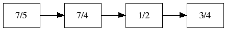

Smarc Manual
============

This short manual show how to use the ``smarc`` program.

Quick start
-----------

First, get help with the ``-h`` option::

    > smarc -h
    smarc resamples audio files using multi stage polyphase filters

    Usage: smarc [-hv] [--verbose] -r int --nbits=int [-c s|d|1|2|..] /
                 [-b 0..1] [--rp=0.1] [--rs=100] [--tol=0.000001] /
                 [--ratios=L1/M1 L2/M2 ...] audiofile audiofile
            -h, --help print this help and exit
            -v, --version print version information and exit
            --verbose more logs
            -r, --rate=int samplerate of output file
            --nbits=int force output sample format to 16|24|32 bits.
                    If not defined, use the input format.
            -c, --channels=s|d|1|2|.. used when input file has more than 1 channel
                    's' resample each channels separately (default)
                    'd' downmix using mean of channels
                    '1' keep only first channel
                    '2' keep only second channel
                    '<N>' keep only Nth channel
            -b, --bandwidth=0..1 define the bandpass filter bandwidth, in relation
                    with maximum possible bandwidth (default=0.95)
            --rp=0.1 ripple factor of pass band filter, in dB
            --rs=140 ripple factor of stop band filter, in dB
            --tol=0.000001 converter samplerate tolerance (default=0.000001)
            --ratios=L1/M1 L2/M2 ... multistage ratios definitions.
                    If not given, smarc will try to find appropriate ratios
            --fast search for fastest conversion stages.

The most straightforward way to resample an audio file is::

    > smarc -r <targetrate> <inputfile> <outputfile>
    
This will produced an outputfile similar to inputfile (same number of channels, same sample format) with a samplerate equals to ''targetrate''.

Change output format
--------------------

The ``--nbits`` option can control the output sample format (16|24|32 bits).

The ``-c`` option can be used when input file has more than 1 channel. See help for details

Control conversion speed and quality
------------------------------------

Several option affects the conversion process and let the caller emphasize speed or quality. The default options leads to a 
safe and quite fast conversion with very good quality. But the expert user may tune some parameters to obtain higher quality 
or faster processing.

Low-pass filter synthesis
^^^^^^^^^^^^^^^^^^^^^^^^^

The sample rate conversion process requires a low-pass filter to remove frequency aliasing. The output quality is highly tied with
the low-pass filter quality. Smarc builds this low-pass filter on demand (using the Remez algorithm), depending on 3 parameters:

``-b, --bandwidth=0..1``
    The part of the bandwidth to preserve. In practice, preserving 100% of the maximum bandwidth is not possible. The default is 
    95% (``-b 0.95``). Depending on conversion ratios, Smarc allows ``-b`` options up to 99% (0.99), resulting in much more
    computations. Reducing the bandwidth to 90% (``-b 0.9``) or 80% (``-b 0.8``) is also possible and results in less computations.

``--rp=0.1``
    The ripple factor of pass band, in dB. Default is 0.1, lower value (like ``--rp=0.05`` or ``--rp=0.01``) gives a more accurate output and requires more computations.
    
``--rs=140``
    The filter's attenuation in the stop band, in dB. Default is 140, higher value (like ``--rs=150``) gives a more accurate output and requires more computations,
    lower value (``--rs=100``) gives a less accurate output and requires less computations.

Conversion stages
^^^^^^^^^^^^^^^^^

Smarc is a '''multi-stage''' sample rate converter. For example, consider the 48000Hz to 44100Hz conversion:

.. math:: \frac{44100}{48000} = \frac{147}{160} = \frac{3*7*7}{2*2*2*2*2*5}

A one-stage converter have to perform a :math:`\frac{147}{160}` conversion, but depending on parameters the low-pass filter for this
stage will be very large or impossible to synthesize.In order to reduce this complexity, smarc automatically cuts the conversion into 
multiple stages. For example :

The default behavior of ``smarc`` is to use predefined stage decomposition for standard conversions, and a basic stategy for non-standard
conversions (build ratios with small primes and order them to build a coherent sequence: interpolations stages before decimation ones).

To see which decomposition stages are used, use the ``--verbose`` option::

    > smarc -r 44100 input48k.wav output.wav --verbose
    multi-stage polyphase resample from 48000Hz to 44100Hz
      passband to 20947.50Hz, passband ripple factor 0.10dB
      stopband from 22050.00Hz, stopband ripple factor 140.00dB
    successive resample stages are :
      7 / 5 : filter length = 391, delay = 39
      7 / 4 : filter length = 113, delay = 14
      1 / 2 : filter length = 45, delay = 11
      3 / 4 : filter length = 913, delay = 114
    resample mono audio file
    
Some options can alterate the stage decomposition:

``--fast``
    This option make Smarc searching for the ''best'' stage decomposition according to given quality parameters. It may take time,
    and it is not always guaranteed to succeed, but if it does, the found decomposition is usually faster to compute than the default one,
    with the same output quality.
    
``--tol=0.000001``
    The tolerance option allow smarc to convert to a sample rate which is close to the desired one. This is usefull for complex 
    conversions, i.e. conversion that cannot be expressed by a ratio of small prime numbers.
    
    .. math:: | \frac{smarc \ output \ rate}{desired \ output \ rate} | < tol
    
    If a non-exact conversion is acceptable, this may be a solution in complex situations.
    
``--ratios="L1/M1 L2/M2 ..."``
    This options let the caller define explicitly the decomposition stages.

    